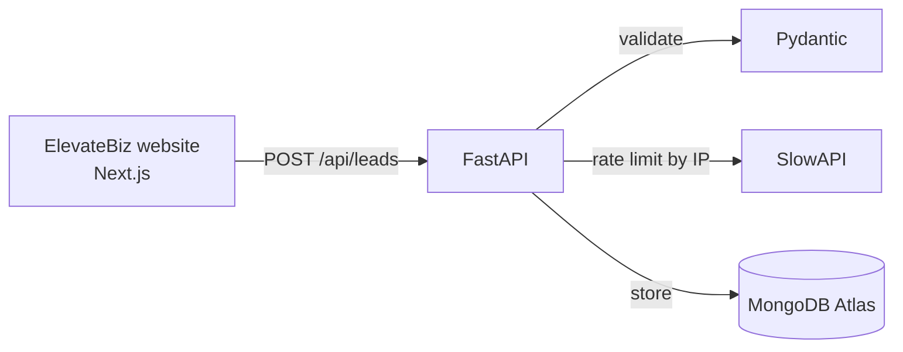

# ElevateBiz API


REST API that receives contact form leads from the [ElevateBiz](https://elevatebiz.ai) website, validates them, and stores them in MongoDB Atlas. Next step: an AI layer (LangChain + OpenAI) that classifies each lead by department and urgency.

## Architecture



## Features

- **Request validation** with Pydantic: required fields, length limits and email format.
- **Rate limiting** of 3 submissions per IP per day, to stop spam and bots.
- **CORS** restricted to the ElevateBiz domains.
- **Async MongoDB** driver, so the API never blocks while saving.
- **Interactive docs** generated automatically at `/docs`.

## Coming next: AI lead classification

Each new lead will be sent to an LLM (LangChain + OpenAI) that returns a structured classification:

- **Department:** sales, support, partnerships, or other
- **Urgency:** low, medium, or high

The result is saved with the lead in MongoDB, so every request reaches the right team with the right priority.

## Endpoints

| Method | Route        | Description                          |
|--------|--------------|--------------------------------------|
| GET    | `/health`    | Health check                         |
| POST   | `/api/leads` | Validates and stores a contact lead  |

### Example

**Request**
```http
POST /api/leads
Content-Type: application/json

{
  "name": "Emily Johnson",
  "email": "emily.johnson@example.com",
  "is_community": false,
  "comments": "I need help with my marketing"
}
```

**Responses**

| Code | Meaning |
|------|---------|
| `201` | Lead saved, returns `{ "id": "..." }` |
| `422` | Invalid data (e.g. bad email format) |
| `429` | Too many submissions from the same IP |

## Key decisions

- **Validation lives in the backend.** The website validates too, but anyone can call the API directly, so the API never trusts the client.
- **Rate limit by IP, not by email.** Emails are easy to fake; IPs are much harder to rotate.
- **Secrets in environment variables.** The MongoDB connection string lives in `.env`, which is never committed.

## Tech stack

- **Python 3.12** + **FastAPI**
- **MongoDB Atlas** (async PyMongo driver)
- **Pydantic** for validation
- **SlowAPI** for rate limiting
- **uv** for dependency management

## Getting started

1. Install dependencies:
   ```bash
   uv sync
   ```
2. Create a `.env` file in the project root:
   ```
   MONGODB_URI=your-mongodb-atlas-connection-string
   ```
3. Run the server:
   ```bash
   uv run uvicorn elevatebiz_api.main:app --reload
   ```
4. Open the interactive docs at http://localhost:8000/docs

## Roadmap

- [x] Receive and validate contact form leads
- [x] Store leads in MongoDB Atlas
- [x] Rate limiting by IP
- [x] Connect the website's contact form
- [ ] Classify each lead with AI: LangChain + OpenAI (department + urgency)
- [ ] Route leads to the right department
- [ ] Deploy to a VPS