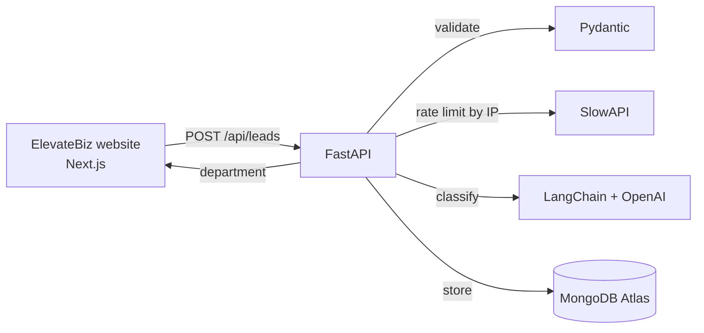

# ElevateBiz API


REST API that receives contact form leads from the [ElevateBiz](https://elevatebiz.ai) website, classifies each one with AI (LangChain + OpenAI) by department and urgency, writes a short summary, and stores everything in MongoDB Atlas.

## Architecture



## Features

- **AI lead classification** with LangChain + OpenAI: department, urgency, and a short summary for each lead.
- **Structured output:** the model can only answer with the allowed values, enforced by a Pydantic schema.
- **Request validation** with Pydantic: required fields, length limits and email format.
- **Rate limiting** of 3 submissions per IP per day, to stop spam and bots.
- **CORS** restricted to the ElevateBiz domains.
- **Async MongoDB** driver, so the API never blocks while saving.
- **Interactive docs** generated automatically at `/docs`.

## AI lead classification

Each new lead is sent to an LLM (LangChain + OpenAI, `gpt-4o-mini`) that returns a structured classification:

| Field | Values | Used for |
|-------|--------|----------|
| `department` | `sales`, `support`, `partnerships`, `other` | Routing the lead to the right team |
| `urgency` | `low`, `medium`, `high` | Deciding who to answer first |
| `summary` | One or two sentences | Understanding the request without reading it all |

All three fields are saved with the lead in MongoDB. The website only receives the department, to tell the visitor where their message went. Urgency and summary stay internal.

**Example:** the message *"My system is down"* is classified as `support`, urgency `high`, with the summary *"The lead is an existing client experiencing a system outage and needs urgent assistance."*

## Endpoints

| Method | Route        | Description                                   |
|--------|--------------|-----------------------------------------------|
| GET    | `/health`    | Health check                                  |
| POST   | `/api/leads` | Validates, classifies with AI and stores a lead |

### Example

**Request**
```http
POST /api/leads
Content-Type: application/json

{
  "name": "Emily Johnson",
  "email": "emily.johnson@example.com",
  "is_community": false,
  "comments": "I own a restaurant and I'm losing customers because I can't answer WhatsApp fast enough. I'd like a quote this week."
}
```

**Response** `201 Created`
```json
{
  "id": "6ac1c6b967bfc61864174f8f",
  "department": "sales"
}
```

**Stored in MongoDB**
```json
{
  "name": "Emily Johnson",
  "email": "emily.johnson@example.com",
  "is_community": false,
  "comments": "I own a restaurant and I'm losing customers ...",
  "created_at": "2026-10-04T03:23:35.740Z",
  "department": "sales",
  "urgency": "high",
  "summary": "The lead owns a restaurant and is losing customers due to slow WhatsApp responses; they are seeking a quote this week."
}
```

**Responses**

| Code | Meaning |
|------|---------|
| `201` | Lead saved, returns `{ "id": "...", "department": "..." }` |
| `422` | Invalid data (e.g. bad email format) |
| `429` | Too many submissions from the same IP |

## Key decisions

- **Validation lives in the backend.** The website validates too, but anyone can call the API directly, so the API never trusts the client.
- **Rate limit by IP, not by email.** Emails are easy to fake; IPs are much harder to rotate.
- **A lead is never lost.** If the AI call fails (no credit, timeout, invalid output), the lead is still saved with `department: "unassigned"` and the error is logged.
- **Structured output over free text.** The model fills a Pydantic schema with fixed values, so the API never has to parse free-form text.
- **Prompt injection guard.** The system prompt treats the visitor's message as data to classify, never as instructions.
- **Urgency stays internal.** Showing "low priority" to a customer would hurt the experience, so only the department is returned.
- **Least-privilege API key.** The OpenAI key only has the permissions this API needs.
- **Secrets in environment variables.** Connection strings and API keys live in `.env`, which is never committed.

## Tech stack

- **Python 3.12** + **FastAPI**
- **LangChain** + **OpenAI** for AI classification
- **MongoDB Atlas** (async PyMongo driver)
- **Pydantic** for validation and structured AI output
- **SlowAPI** for rate limiting
- **uv** for dependency management

## Getting started

1. Install dependencies:
   ```bash
   uv sync
   ```
2. Create a `.env` file in the project root:
   ```
   MONGODB_URI=your-mongodb-atlas-connection-string
   OPENAI_API_KEY=your-openai-api-key
   ```
3. Run the server:
   ```bash
   uv run uvicorn elevatebiz_api.main:app --reload
   ```
4. Open the interactive docs at http://localhost:8000/docs

## Roadmap

- [x] Receive and validate contact form leads
- [x] Store leads in MongoDB Atlas
- [x] Rate limiting by IP
- [x] Connect the website's contact form
- [x] Classify each lead with AI: LangChain + OpenAI (department, urgency, summary)
- [x] Show the assigned department to the visitor
- [ ] Deploy to a VPS
- [ ] Split the code into modules (models, database, classifier)
- [ ] Cloudflare in front of the domain (DDoS and bot protection)
- [ ] Cloudflare Turnstile on the contact form
